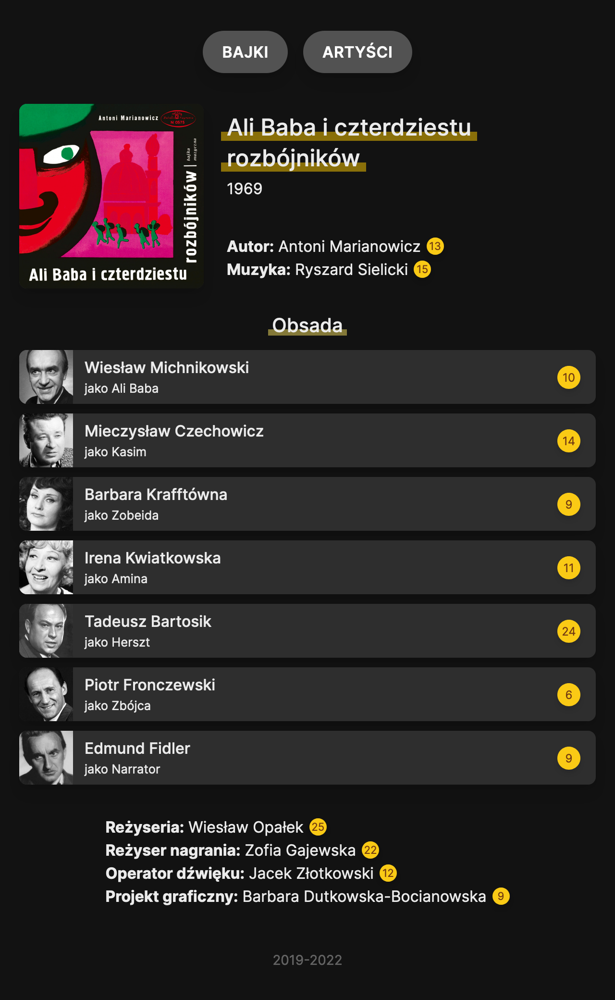
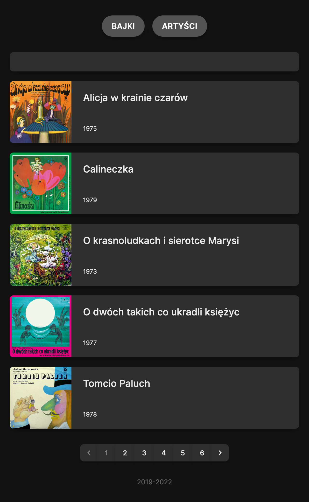

## About

This repo contains the source code of https://bajki-muza.pl,
a knowledge base about audio tales recorded by Polskie Nagrania Muza.

<div align="center">
  <picture>
    <source
      srcset="resources/screenshots/tale-light.png"
      media="(prefers-color-scheme: light)"
    >
    
  </picture>

  <picture>
    <source
      srcset="resources/screenshots/index-light.png"
      media="(prefers-color-scheme: light)"
    >
    
  </picture>
</div>

## Installation

Clone this repository and install it like you normally install Laravel application.

- Install dependencies (`composer install && yarn install`)
- Generate assets with `yarn dev`
- Copy `.env.example` to `.env` and set environment variables
- Set application key with `php artisan key:generate`
- Run database migrations (`php artisan migrate`)

## Testing

This application uses PHPUnit for testing and PHPStan for static analysis.

```sh
vendor/bin/phpunit --testdox  # Tests
vendor/bin/phpstan analyse    # Static analysis
vendor/bin/php-cs-fixer fix   # Formatting
```
